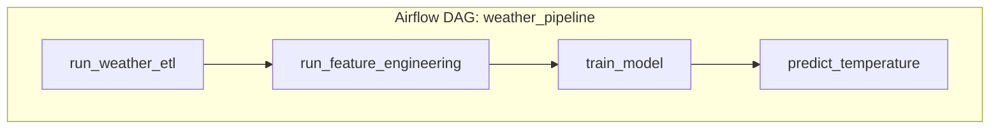

# Weather ETL + ML Prediction Pipeline

Production-style data engineering project:
OpenWeatherMap API → Python ETL → PostgreSQL → (Airflow) → Streamlit

And extends the pipeline with:
PostgreSQL historical data → feature engineering → model training → next-temperature prediction

## What this project is about

This repo demonstrates an end-to-end workflow you’d build in a real data team:

- **ETL**: fetch current weather from OpenWeatherMap and append it into Postgres (`weather_data`)
- **Orchestration (optional)**: schedule the pipeline via Airflow (Docker)
- **Analytics/UI**: Streamlit dashboard shows latest reading + trends
- **ML (Phase 2)**: train a regression model on the stored history and display a **predicted next temperature** in Streamlit

## How it works (high level)

1. **Extract** ([src/extract.py](src/extract.py)) calls OpenWeatherMap.
2. **Transform** ([src/transform.py](src/transform.py)) normalizes JSON → a DataFrame.
3. **Load** ([src/load.py](src/load.py)) appends rows into Postgres table `weather_data`.
4. **Features** ([src/features.py](src/features.py)) builds rolling / lag-style features per city.
5. **Train** ([src/train_model.py](src/train_model.py)) trains a regressor and saves `model.pkl`.
6. **Predict** ([src/predict.py](src/predict.py)) loads `model.pkl` and predicts the next temperature from the latest DB record.
7. **Streamlit** ([dashboard/app.py](dashboard/app.py)) shows latest + trends + prediction.

## Prerequisites

- Python 3.10+ recommended
- PostgreSQL running locally or remotely
- (Optional) Docker Desktop, if you want to run Airflow via Docker Compose

> Airflow: not officially supported on native Windows. Use Docker or WSL2 for the Airflow part.

## Quickstart (Windows / local)

### 1) Create a virtual environment

```powershell
python -m venv .venv
./.venv/Scripts/Activate.ps1
```

### 2) Install dependencies

```powershell
pip install -r requirements.txt
```

### 3) Configure environment variables

- Copy [​.env.example](.env.example) → `.env`
- Set `OPENWEATHER_API_KEY`
- Set DB settings (`POSTGRES_*`) or set `DATABASE_URL`

### 4) Run the ETL (writes into Postgres)

```powershell
python run_pipeline.py --city Colombo
```

### 5) Train the ML model (creates model.pkl)

```powershell
python -m src.train_model --model-path model.pkl --city Colombo
```

### 6) Run the dashboard (shows prediction)

```powershell
streamlit run dashboard/app.py
```

## Configuration notes (Docker + Windows)

If you run **Airflow in Docker** but **Streamlit locally** on Windows, you typically want:

- `.env` tuned for Docker containers reaching your host Postgres:
  - `POSTGRES_HOST=host.docker.internal`
- `.env.local` tuned for local apps:
  - `POSTGRES_HOST=localhost`

The app loads `.env.local` first (if present), then `.env`.

## OpenWeatherMap API quick test

Once you have an API key, you can test in a browser:

- <https://api.openweathermap.org/data/2.5/weather?q=Colombo&appid=YOUR_KEY&units=metric>

## Airflow (Docker, optional)

This repo includes a minimal Docker Compose setup for Airflow (scheduler + webserver + metadata Postgres).

1. Build + initialize Airflow
   - `docker compose up airflow-init`

2. Start Airflow
   - `docker compose up -d`

3. Open the UI
   - <http://localhost:8080>
   - Username: `airflow`
   - Password: `airflow`

4. Unpause and run the DAG
   - DAG id: `weather_pipeline`
   - Task order: **ETL → Features → Train → Predict**

5. (Optional) Container-side DB connectivity check
   - Confirms the Airflow container can reach your weather database using `.env` settings.
   - Command:
     - `docker compose exec -T airflow-scheduler bash -lc "cd /opt/airflow/project && python -c \"from sqlalchemy import create_engine, text; from src.config import get_settings, build_database_url; url=build_database_url(get_settings()); eng=create_engine(url); print(eng.connect().execute(text('select 1')).scalar())\""`
   - Expected output: `1`

## Project structure

- `src/` ETL + ML modules
- `dags/` Airflow DAG
- `dashboard/` Streamlit app
- `tests/` unit tests

## Data model

The ETL writes into a single append-only table (default: `weather_data`) with:

- `city` (text)
- `temperature` (float)
- `humidity` (int)
- `pressure` (int)
- `weather_description` (text)
- `timestamp` (UTC, timezone-aware)

## Architecture

```mermaid
flowchart LR
    A[OpenWeatherMap API] -->|requests| B[Extract: src/extract.py]
    B --> C[Transform: src/transform.py]
    C -->|SQLAlchemy| D[(PostgreSQL: weather_data)]

    E[Airflow DAG: dags/weather_pipeline_dag.py] -->|schedule/trigger| F[ETL runner: src/pipeline.py]
    F --> D

    D --> H[Features: src/features.py]
    H --> I[Train: src/train_model.py]
    I --> J[(model.pkl)]
    D --> K[Predict: src/predict.py]
    J --> K
    K --> L[Predicted temperature (Streamlit + CLI)]

    G[Streamlit: dashboard/app.py] -->|read| D
```


