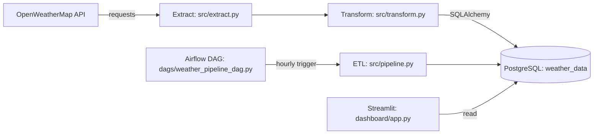

# Weather ETL Pipeline

Production-style data engineering project:
OpenWeatherMap API → Python ETL → PostgreSQL → Airflow → Streamlit

## What this project demonstrates

- Extracts current weather for a configurable city from OpenWeatherMap
- Normalizes API JSON into an analytics-friendly table (`weather_data`) in Postgres
- Schedules the ETL hourly via Airflow (Docker)
- Visualizes latest reading + trends in a Streamlit dashboard

## Prerequisites

- Python 3.10+ recommended
- PostgreSQL running locally or remotely

> Airflow: not officially supported on native Windows. Use WSL2 or Docker for the Airflow part.

## Setup (Windows / local)

1. Create a virtual environment
   - `python -m venv .venv`
   - `./.venv/Scripts/Activate.ps1`

2. Install dependencies
   - `pip install -r requirements.txt`

3. Configure environment variables
   - Copy `.env.example` → `.env`
   - Set `OPENWEATHER_API_KEY`
   - Set DB settings (`POSTGRES_*`) or `DATABASE_URL`

## OpenWeatherMap API quick test

Once you have an API key, you can test in a browser:

`https://api.openweathermap.org/data/2.5/weather?q=Colombo&appid=YOUR_KEY&units=metric`

## Airflow (Docker)

This repo includes a minimal Docker Compose setup for Airflow (scheduler + webserver + metadata Postgres).

1. Configure `.env`
   - Ensure `OPENWEATHER_API_KEY` is set
   - For connecting to your host Postgres from Docker on Windows, set `POSTGRES_HOST=host.docker.internal`
   - If you also run the Streamlit dashboard locally on Windows, create `.env.local` with `POSTGRES_HOST=localhost` (it overrides `.env`)

2. Build + initialize Airflow
   - `docker compose up airflow-init`

3. Start Airflow
   - `docker compose up -d`

4. Open the UI
   - http://localhost:8080
   - Username: `airflow`
   - Password: `airflow`

5. Unpause and run the DAG
   - DAG id: `weather_pipeline`
   - Unpause it, then trigger manually or wait for the hourly schedule

6. (Optional) Container-side DB connectivity check
   - Confirms the Airflow container can reach your weather database using `.env` settings.
   - Command:
     - `docker compose exec -T airflow-scheduler bash -lc "cd /opt/airflow/project && python -c \"from sqlalchemy import create_engine, text; from src.config import get_settings, build_database_url; url=build_database_url(get_settings()); eng=create_engine(url); print(eng.connect().execute(text('select 1')).scalar())\""`
   - Expected output: `1`

## Project structure

- `src/` ETL modules
- `dags/` Airflow DAG
- `dashboard/` Streamlit app

## Run the ETL (Step 5)

1. Ensure `.env` is configured
   - `OPENWEATHER_API_KEY`
   - DB settings (`POSTGRES_*`) or `DATABASE_URL`

2. Run the pipeline
   - `python run_pipeline.py --city Colombo`

## 2-minute demo script (good for a README / interview)

1. Run the ETL twice (a minute apart) so you have multiple points
   - `python run_pipeline.py --city Colombo`

2. Start the dashboard
   - `streamlit run dashboard/app.py`

3. (Optional) Show orchestration
   - `docker compose up airflow-init`
   - `docker compose up -d`
   - Open http://localhost:8080 and trigger `weather_pipeline`

## Dashboard (Step 7)

Run the Streamlit app:

- `streamlit run dashboard/app.py`

## Data model

The ETL writes into a single append-only table (default: `weather_data`) with:

- `city` (text)
- `temperature` (float)
- `humidity` (int)
- `pressure` (int)
- `weather_description` (text)
- `timestamp` (UTC, timezone-aware)

## Architecture

## Next steps

Optional enhancements if you want to push this further:

- Add data quality checks (null/threshold checks) before loading
- Add deduplication / upsert strategy (e.g., unique key on city+timestamp)
- Add historical backfill and partitioning strategy
- Add CI (lint/tests) and pinned dependency constraints for long-term reproducibility
